# TSMap

## 备注

所有代码分为四个仓库：

- 前端：https://github.com/TSStudio/ds-pj-frontend
- 后端：https://github.com/TSStudio/ds-pj
  - *注：旧代码包括了存边的四叉树等，值得一看。https://github.com/TSStudio/ds-pj/tree/5dd96a94200ec22988714abc549d37fbeeb70741
  - *注：包含了一个尝试离散化优化的分支，但是效果不明显。https://github.com/TSStudio/ds-pj/tree/jumping
- 渲染器：https://github.com/TSStudio/ds-pj-renderer
- 后端 II（用于保存点集）：https://github.com/TSStudio/ds-pj-backend

## 基本功能完成情况

> 画地图，具体来说需要读入地图数据然后用线条等要素绘制出来。可以是任意地区的地图数据。

已实现，区域取决于向 PostGIS 导入的数据范围。绘制为本人独立实现（估计也没有别人用 PHP 写过这种东西）。

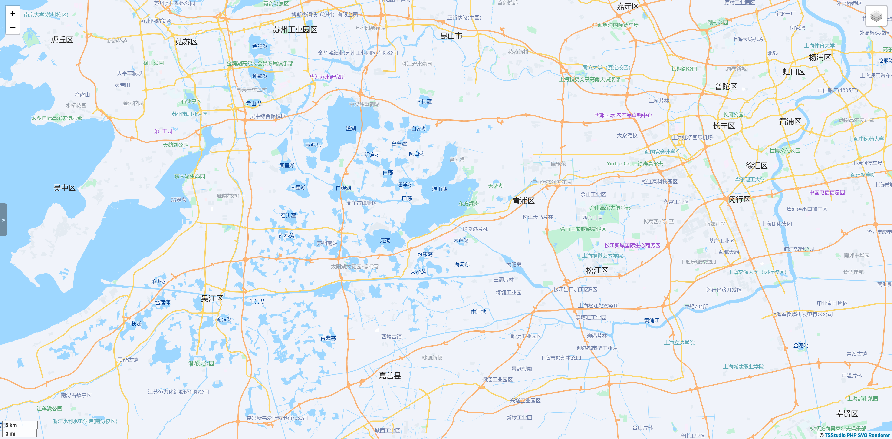

> 算法要求需要实现两点间沿地图道路的最短路  
> 可以只是地图数据中有的点（基础功能）  

已实现，使用了双向 A* 算法。速度优化属于附加功能。

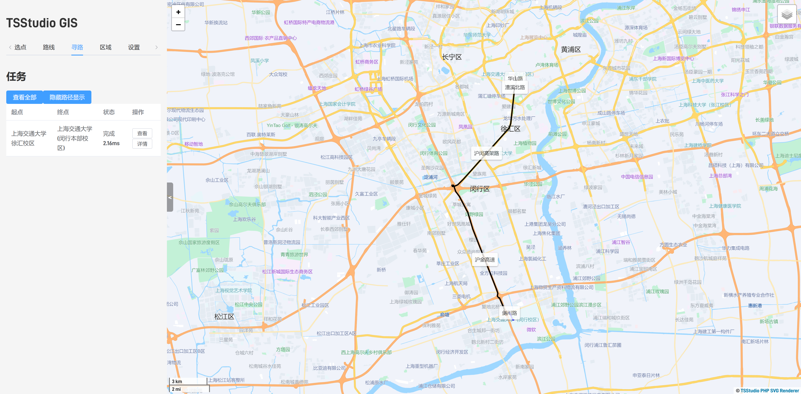

## 附加功能完成情况

### 原始文档提到的附加功能全部实现

> 地图绘制

渲染器做了相当多的精细化处理。

**此功能具体实现说明在后面有大篇幅说明（“绘制地图（渲染器）”），此处不赘述。**

图片见上文。

> 也可以是任取两点（附加功能）

已实现，使用了四叉树进行加速。**注意到提前展示时有疑问：是否最近点一定是最优的？**。这显然是选点本身的问题，就像你在重庆的高架桥旁边定位，也不一定给你弄到哪一层去，而且我们选点肯定我确定目前就在某一条路的路边，从此出发出发，而不是从没有路的地方找到“最优”的路。如果是这样，那是另外的最优化问题。

**此功能具体实现说明在后面有大篇幅说明（“最近邻搜索”），此处不赘述。**

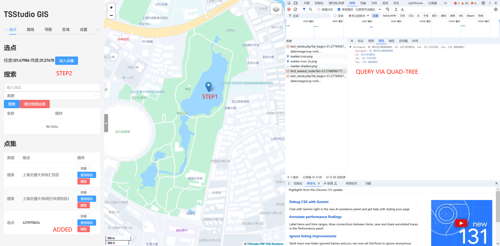

> 可以额外考虑道路通行限制，如只走主干道或者车辆和行人差异

支持多种交通工具的任意组合。会读取地图中的道路级别、限速、限行信息进行处理。


如果道路有限速或限行标签（tag），直接加载这一配置到边上即可。如果没有，根据其道路分级进行推断，较高等级的道路拥有比较快的限速，因此寻路时会较为倾向于选择较高等级的道路。

> 其他额外功能可以自行发挥  
> 算法层面包括最近邻搜索、最短路优化等

最短路优化到常规距离（10km 以内）低于 1ms。最近邻搜索使用四叉树。

**此功能具体实现说明在后面有大篇幅说明（“寻路算法问题”），此处不赘述。**  
**此功能具体实现说明在后面有大篇幅说明（“最近邻搜索”），此处不赘述。**

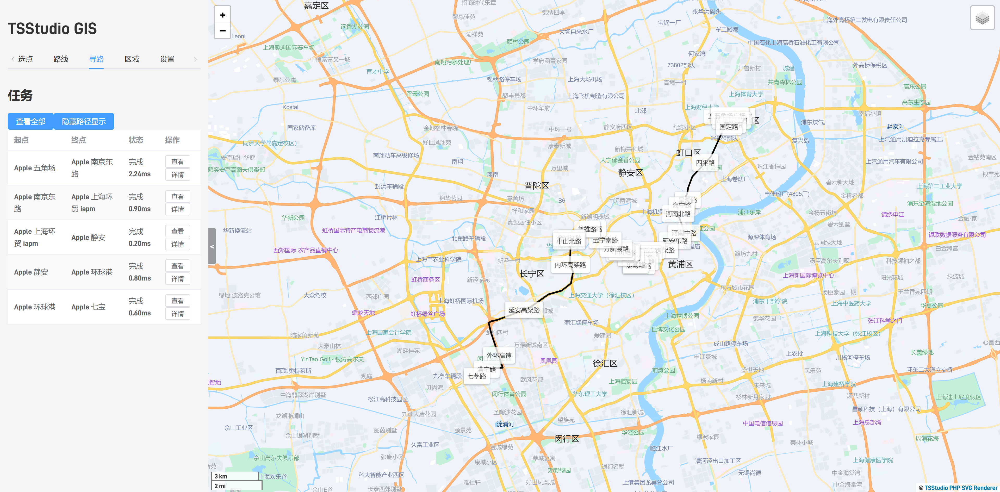

> 地图功能也算但相对不注重

支持选择卫星图作为底图。支持搜索地点。调用了高德地图的 API 和谷歌地图的卫星底图。

使用高德地图 API 查询显然是最方便的方法。考虑到 OSM 的数据标注简直就是依托（五角场万达还有个什么“特力时尚汇”，我在五角场逛这么长时间都没发现，估计这地方早就黄铺子了）。

注意到高德地图 API 返回的点仍然是经纬度，故我们还是得接入下面的**用户选点**来转化为我们的点的 ID。

注意到高德查询回的经纬度与实际位置存在一定的偏差，经查是高德使用了 GCJ-02 坐标系，而我们使用的是 WGS-84 坐标系。因此需要进行坐标转换。理论上这一转换是进行不了的（GCJ-02 是为了保护国家安全而创造的**单向加密**算法），但实际上对精度要求足够低就可以近似得到一个结果。


### 创新的附加功能

> 公交、地铁的支持

**此功能具体实现说明在后面有大篇幅说明（“寻路精细化处理问题”），此处不赘述。**

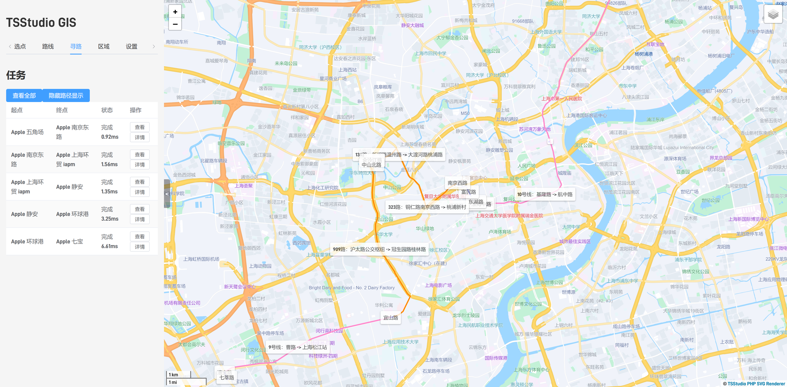

> 限行区域设置（白名单或黑名单模式）。

在前端实现了多边形绘制与编辑。以及多个区域的管理。后端支持点在区域内外的判定。

考虑一个多边形实际上是点的序列，判断一个给定的坐标是否在这个多边形里，可以以这个点为起点，发射一条射线，判断与多边形的各边有几个交点，如果是奇数个，那么这个点在多边形内，否则在多边形外。在寻路时进行判断即可。为了性能，可以向正北方向发射射线，这样可以减少计算量。

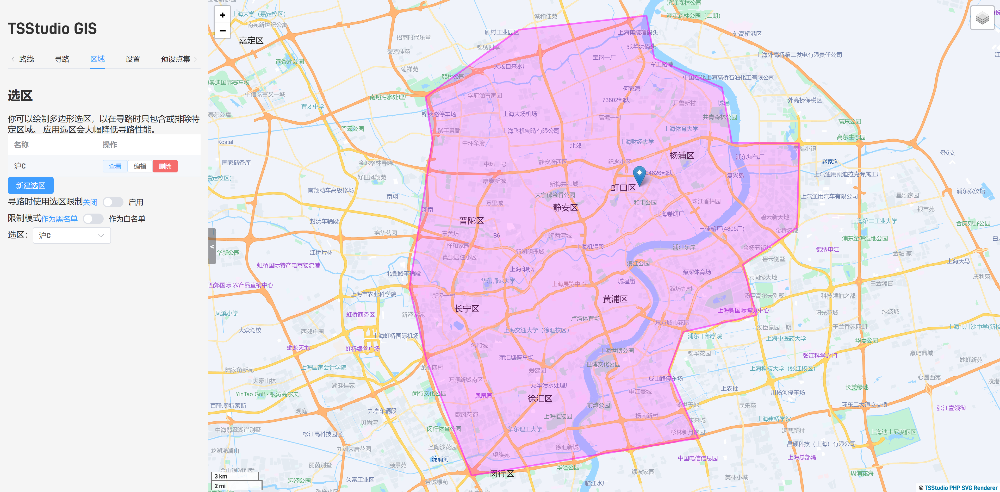
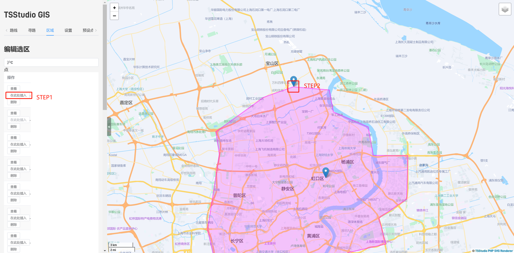

> 点集选取

由于支持多条路径同时寻路（包含途经点），因此支持多点选取，这势必要支持同时选取很多点作为备选。没有什么技术含量，前端用一个 Array 存储即可。

> 点集支持用户多端同步

这一点和我之前写过的用户管理系统对接即可，该系统提供认证服务和 UID，然后数据直接存到 SQL 里就行了，没什么难度。

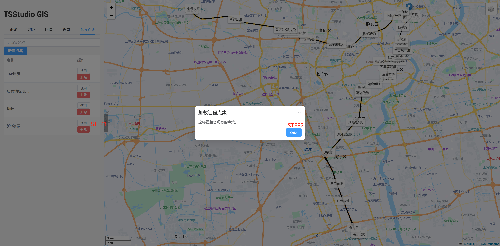

> 多路线同时寻路

即并发多个请求，没有什么难度。后端 Crow 原生支持多线程。

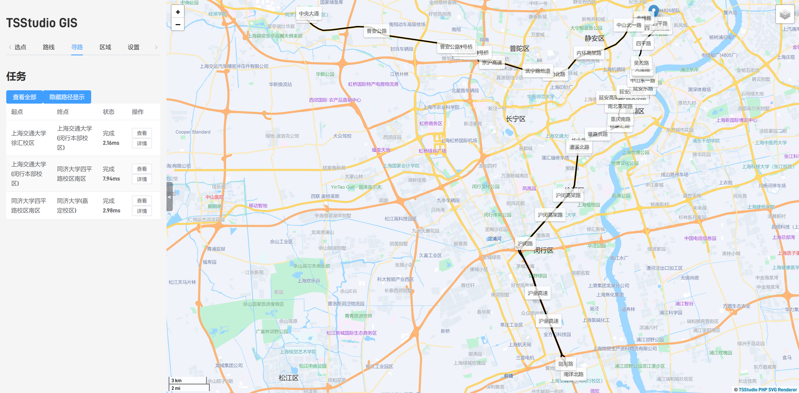

> 路线查看

支持在地图上以不同颜色显示不同出行方式的段，且支持以文字形式显示方案详情。能在正好中间的位置显示路名。

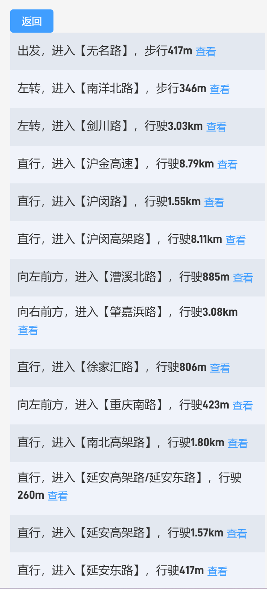
另见上文

> TSP 问题

旅行商人问题，即支持用户选取多个点后，找到一个顺序使得依次访问这些点的路径最短。这个问题是 NP Complete 的（ $O(n!+n^2|V|\log |V|)$ ），经测试，对于 12 个点以内的问题，可以在 1s 左右解决。


> 寻路调试器

可计算寻路过程中所有访问到的点的凸包并在前端显示，以确定这一寻路算法的搜索范围，用于优化性能。实际上只需要通过 Andrew 算法处理 vis 集合中包含的点即可。并在返回时一并返回给前端。

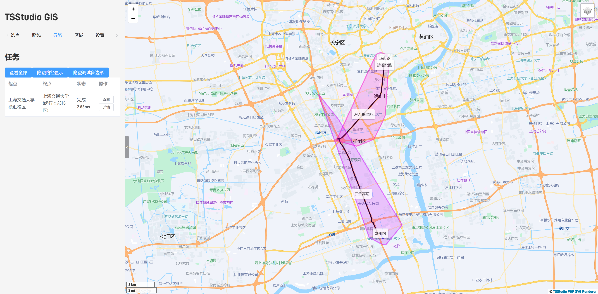

> Weighted A*

支持在前端调整启发式搜索的程度。

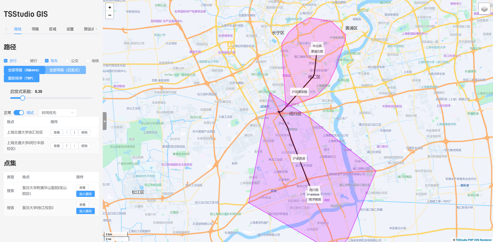

> 前端大多数配置支持自动保存到 Local Storage

由于 Vue 支持响应式，因此可以侦听数据的变化，然后保存到 Local Storage。这样可以保证用户的配置不会因为刷新而丢失。在页面初始化时，从 Local Storage 读取数据。这些数据包括：点集、搜索结果、地图位置与缩放等。

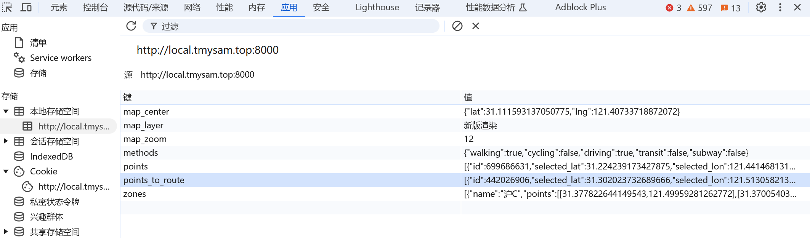

## 项目运行方法

### 前端

环境要求：Node.js

运行 `npm install` 安装依赖。请注意，这需要**互联网连接**。
运行 `npm run serve` 启动开发服务器。
运行 `npm run build` 打包。

### 后端

环境要求：Linux x86_64，CMake，GNU GCC（14 或以上）

安装 Crow，依据此说明：

https://crowcpp.org/master/getting_started/setup/linux/

安装 unordered_dense，依据此说明：

https://github.com/martinus/unordered_dense?tab=readme-ov-file#2-installation

安装 boost，依据此说明：

https://www.boost.org/doc/libs/1_87_0/more/getting_started/unix-variants.html

另外，需要将 `nlohmann_json` 和 `pugixml` 放在项目目录下。

运行 `cmake .` 生成 Makefile。
运行 `make` 编译。若使用多线程编译，可以使用 `make -j`。

### 渲染器

环境要求：PHP，nginx，PostgreSQL，PostGIS，osm2pgsql

安装 PHP、nginx 并配置 CGI 支持，依据此说明：

https://www.php.net/manual/zh/install.php

安装 PostgreSQL 和 PostGIS 插件，依据此说明：

https://postgis.net/documentation/getting_started/#installing-postgis

使用 osm2pgsql 导入地图数据，依据此说明：

https://osm2pgsql.org/doc/manual.html

将 php-svg 库安装到同一目录下。

### 后端 II

该后端是用于保存点集，环境要求：PHP，nginx，MySQL

## 使用说明

前端的操作应该非常的显然，不太需要做单独的说明，由以上功能图可以看到。

后端：可执行文件接受若干个参数，表示加载的 .osm 文件的路径。例如：

```shell
./server map1.osm map2.osm
```

若不提供参数，则默认加载 `data/sh-red.osm`。（含义为 Shanghai Reduced）

**注意，对于每个 osm 文件，首次加载时不会显示进度条**（第一次加载后，根据节点数量创建对应的 json 元数据文件，之后加载时会显示进度条）。

渲染器：需要配置数据库账号密码，然后放到网站的 ds/ 目录下。

后端 II：由于对接的项目闭源，故不提供说明（没有意义）。

## 使用的开源项目

### 前端
- Node.js （编程语言，提供打包环境）
- Webpack （打包及调试工具）
- Vue.js （响应式框架）
- Leaflet （地图显示库）
- Element Plus （UI库）

### 后端
- GNU GCC （编译器）
- CMake （包管理器，编译工具）
- pugixml （xml 读取）
- nlohmann_json （json 编码、读取、写入）
- Crow （http服务）
- ankerl::unordered_dense （数据结构相关，哈希表）
- boost （数据结构相关，堆）

### 渲染器
- PHP, fastcgi （编程语言，cgi）
- nginx （HTTP 服务器）
- osm2pgsql （osm文件与数据库插入）
- PostgreSQL （数据库）
- PostGIS （数据库插件，用于支持地理信息）
- meyfa/php-svg （用于绘制 SVG 图形）

### 第三方 API
- 高德地图（POI查询）
- Google 地图（卫星图层）
- Bing/Azure 地图（海外POI查询）

## 绘制地图（渲染器）

绘制地图的部分，经过了几次迭代。都是基于瓦片的绘制，此处介绍如下：

### 第一版 基于点查询的前端绘制

考虑实现一种合适的数据结构存储所有的点，在绘制某一瓦片时，获取涉及到该瓦片的所有点，再处理涉及到这些点的边。这样的好处是实现非常简单，因为后端一定是要存储所有的点的，可以直接使用已有的数据结构。

不过，这一方式存在以下问题：

1. 如果一个区块内的点连接的线段另一端端点位于另一个区块，则这条线会绘制失败（由于另一个点的位置不在当前区块内，查询的时候也不会查询到这一个点，所以无法绘制）。
2. 如果一条边经过了起点和终点属于的瓦片之外的瓦片，那么这条边会在这些瓦片中不可见。原因很简单，在查询这一瓦片的时候，根本就不知道这条边的存在。

基于以上问题的优化

- 对于 1 的解决方案：由于处理边的时候，知道另一个点的id（或者说，存储在后端的指针），因此同时将这些点的信息返回即可。
- 2 无法优化，这是原理上的缺陷。

### 第二版 基于边查询的前端绘制

因为要画的是边，存点就一定会产生上述问题。因此，考虑直接存边。这样的好处是，从原理上直接解决了上述问题。

考虑使用四叉树存边，这样可以直接对应瓦片(Web Mercator)。对四叉树拆分时进行精细化处理：切块时产生横竖两个切割线，检查每一条边与这两条线的交点，若有交点，则将交点记为新的点（虚拟的，不用于寻路），并将原边拆分为两或三条边。这样可以保证每一条边都在一个瓦片内。

这样就真的没有问题了吗？刚才说的是存点导致查边的时候产生问题，那么类比地，升维一下，存边是否会导致查多边形的时候产生问题？答案是肯定的。考虑以下情况：3x3 的区块，有一个多边形，它的边在外侧 8 个区块内，对于中间区块来说，应该是填满的，但实际上对中间这个区块来说，根本就查询不到这个多边形。

因此，这一版本对于路网绘制来说没有问题，但对多边形来说（例如区域）是不适用的。

### 第三版 基于多边形查询的后端绘制

考虑到实现多边形绘制（其实重点是存储多边形的数据结构）已经超出了我的能力范围（或者说，即使在能力范围内，实现它也明显不是一门课大作业的工作量，这太离谱了），以及基于避免重复造轮子的思想，考虑使用已有的开源项目。最终选择了 osm2pgsql，它可以将 osm 数据导入到 PostgreSQL 数据库中，然后使用 PostGIS 进行查询。

PostGIS 提供了区域索引，也可以直接接收瓦片的坐标，例如查询某一个瓦片内的多边形：

使用形如以下的 SQL 语句获取所有多边形：

```SQL
SELECT *,ST_AsGeoJSON(ST_Transform(way,4326)) FROM planet_osm_polygon
WHERE ST_Intersects(ST_TileEnvelope($1, $2, $3),way)
```

使用以上语句进行查询，使用**参数化查询**，避免 **SQL 注入攻击**。倘若直接使用字符串拼接，就会出现问题。具体请到我的博客 `www.tmysam.top/slides/sql_injection.html` 查看，或使用短链接 `cl15.top/z3gcx` 查看

结合以下子句减少绘制负担

```SQL
AND way_area>$4 LIMIT 2000;
```

因为返回的直接是 GeoJSON，每一个路径都是一个多边形，因此可以直接在前端绘制。

**但遇到了一个麻烦**

这个麻烦来自于以下原因

- 绘制是一个很慢的活
- 很慢的活应该丢给 Web Worker 做并行化处理
- 现在的屏幕普遍采用缩放
- 如果渲染位图，使用 256 作为瓦片大小会比较模糊，因此需要更大
- 瓦片大了，计算量就更大，让 Canvas 处理这么大的瓦片是不现实的
- 考虑直接绘制 SVG，矢量图无所谓缩放
- SVG 需要 DOM 操作，Web Worker 无法操作 DOM

那得了，还是后端渲染吧，毕竟很多后端也有成熟的 SVG 库。  
不过用 C++ 访问数据库是很抽象的事情，基本没人这么干。所以考虑使用我非常熟悉（而且性能还不错），且是**世界上最好的语言**的 PHP。因为干的活非常无脑，就是把 GeoJSON 里的 Polygon 路径，把坐标映射到像素坐标，然后输出 SVG，也不需要什么特别 Fancy 的语言。

**精细化处理**

- 考虑要处理一下先画哪类多边形，这样可以保证覆盖关系正确，还有一些非常抽象的情况，比如一个湖上有一栋楼，楼下面又压了一条路（鬼知道为什么会有这种情况）。由于我们的地图是为了寻路服务的，我的策略还是把路网画在上面。
- 多边形的颜色，我这里直接抄了百度地图的颜色。

基于多边形的 `amenity` `building` `landuse` `natural` `waterway` 等属性进行上色。  
基于多边形的 `amenity` `building` `landuse` `natural` `waterway` 等属性进行图层顺序处理。  
基于路网的 `highway` `railway` `construction` 等属性进行上色和宽度处理。  

**顺带把路网绘制也换了吧，C++那部分就别掺和绘制的活了** 一样的，只不过获取到的是 Polyline。同样的精细化处理（给路上色）。

**性能优化**

上个缓存就行了，建个表，(x,y,z) 作为主键，存 SVG 字符串。这样就不用每次都去数据库查了。（实测不缓存状态下单个瓦片渲染耗时应该在 50ms 左右，缓存查询只需要小于 10ms）

**还存在的一些小问题，如果时间足够应该修复的：**

仍然会出现边角处出现缺角的情况，这是因为路带有宽度，因此解决方法是：让每一个 tile 允许向外出血最大道路宽度并互相覆盖。另：SVG 本身就可以溢出，但是通过 img 方式加载不支持，不过使用 SVG 标签进行渲染的性能存在问题，暂时无力优化。

### 文字

地图上的文字是比较难处理的问题，因为考虑以下问题：

- 不能显示所有的文字，因为会有重叠
- 一个 tile 中的文字，其宽度可能会超过 tile 的宽度。倘若对应的多边形在另一个 tile 中也有，那么还好，如果没有，就会导致文字只剩下一半。
- 即使如此处理，是否因为其他文字优先级更高而不显示文字，在跨区块时也会不同。

因此：考虑直接以屏幕空间为单位，而不是瓦片空间。这样可以保证文字不会被切断。唯一的弊端是无法缓存。

然后与上述多边形一样，从数据库中获取所有的多边形，基于多边形的 `amenity` `building` `landuse` `natural` `waterway` 等属性进行上色。基于多边形的 `size` 进行排序，渲染时处理冲突。

其实还有一个方案，支持缓存，但是性能损耗过于大：渲染一个 tile 的文字时，同时获取其周边 8 个 tile 的文字来处理遮挡问题。

## 存储图的数据结构

对于任何一个 Node:

```cpp
/**
 * @brief Class representing a node in the map
 */
class Node {
public:
    uint64_t id;                                     //unique id
    double lat;                                      //latitude
    double lon;                                      //longitude
    bool road;                                       //is a start of a road, false if only end of a one-way road
    bool pedestrian;                                 //is a pedestrian node
    int level;                                       //minimum appearance level of the node
    bool bus_stop = false;                           //is a bus stop
    bool virtual_node = false;                       //is a virtual node
    char *name = nullptr;                            //name of the node
    std::multiset<EdgePtr> edges;                    //edges connected to the node
    std::vector<ComputedEdge *> computed_edges;      //Computed edges starting from the node
    std::vector<ComputedEdge *> computed_edges_end;  //Computed edges ending at the node
    std::unordered_map<uint64_t, Node *> vpoints;    //virtual point for relation

    Node(uint64_t id, double lat, double lon);                           //constructor
    Node();                                                              //default constructor
    bool operator==(const Node &other) const;                            //equality operator
    bool operator<(const Node &other) const;                             //less than operator
    double distance(const Node &other) const noexcept(true);             //distance to another node
    float distanceF(const Node &other) const noexcept(true);             //distance to another node
    float approxDistanceF(const Node &other) const noexcept(true);       //approximate distance to another node
    double distance(double lat, double lon) const noexcept(true);        //distance to a point
    float distanceF(double lat, double lon) const noexcept(true);        //distance to a point
    float approxDistanceF(double lat, double lon) const noexcept(true);  //approximate distance to a point

    void push_relation(uint64_t relation_id, Node *n, allowance allow, double speed_limit, char *name);  //push a relation
};
```
存储了点的基本信息和与之相连的边。对于任何一个 ComputedEdge（用于寻路的边）：

```cpp
class ComputedEdge {
public:
    Node *start;
    Node *end;
    allowance allow;
    double speed_limit;
    char *name;
    double forceTime;
    double distance;
    float distance_f;
    int methodUsed;
    bool lastGetSuccess = false;
    ComputedEdge(NodePtr start, NodePtr end, allowance allow, double speed_limit, char *name, double forceTime = 0);
    double getTravelTime(int method) noexcept(true);  //bit 0: pedestrian, bit 1: bicycle, bit 2: car, bit 3: bus, bit 4: subway
    float getTravelTimeF(int method) noexcept(true);
    double getDistance(int method) noexcept(true);
    float getDistanceF(int method) noexcept(true);
    bool vis(int method) noexcept(true);
};
```

存储了边的基本信息和与之相连的点。其中 `lastGetSuccess` 存在线程安全问题，但由于一般来说，这个值只会在一个线程内被访问，因此不会出现问题。而且为了解决需要比较大的 overhead，因此为了性能考虑，不使用锁。

其中 `allow` 存储了这条边的通行情况，`speed_limit` 存储了这条边的限速，`name` 存储了这条边的名称。`forceTime` 存储了这条边的通行时间（例如公交的等车时间，不会按照距离计算，如果为 0 则按距离计算），`distance` 存储了这条边的长度。
```cpp
class allowance {
public:
    bool pedestrian;
    bool bicycle;
    bool car;
    bool bus;
    bool subway;
    bool transfer;
};
```

## 寻路算法问题

几乎所有的 GIS 还是使用点和边来存储地图的，因此图论的方法都可以上了。但是，边权并不是简单的长度，需要通过用户选择的交通方式和道路情况确定。例如，对于行人来说，快速路的边权应该是无穷大，表示不可通行，同理，自行车可能并不会受到道路限速的影响（因为本来也骑不了多快），而汽车则会受到限速的影响。

### Dijkstra 算法

不说算法细节，但这玩意实在是很慢（虽然是比较快的算法了，但面对地图数据还是很慢）。Dijkstra 的问题是它处理的是图论中的点，并不是现实中的点。由于 Dijkstra 处理的点的顺序满足与起点的距离（在这里是时间）单调递增，因此可以说它其实是在画等时圆，这显然不现实。我们考虑这样一个情况：

找到一条从上海到北京的最短路。考虑当前处理到距离为 8 小时左右（即南到福建、北到河北）的情况。

- 第一个问题：他处理到了福建之类的地方，完全的南辕北辙，这里的原因是没有考虑到地理上的距离与路网的情况，他在期待：一条从福建到北京的距离非常短的路，但实际上这样的路不可能存在；他在期待：河北到北京不存在距离比较短的路，但实际上这样的路是存在的。
- 第二个问题：他在处理江苏之类的地方，8 小时才能开到的小路，这些路限速很慢，但是他在期待：这些路通向的犄角旮旯里会不会有一个地方能超时空传送的速度到达北京，但实际上这样的地方是不存在的。

### 启发式搜索

解决这两个问题的核心是考虑“估价函数”，在这里实际上是考虑某个点到终点的预估距离（大概可以按直线距离估计）。

这样我们只需要把堆优化的 Dijkstra 稍加改动即可：把排序关键字从 由起点到这一点的距离 改为 由起点到这一点的距离+这一点到终点的估价函数值。其中估价函数值用交通工具的平均速度和直线距离估计。

进一步地，考虑如果不加估价函数值，那么就是纯粹的 Dijkstra 算法，那么如果估价函数值前面的系数为 0-1，甚至 1-∞ 之间的数，我们就可以自定义启发式搜索的程度了。所以实际上我们搓出了“Weighted A*”算法。当系数为 0 时，就是 Dijkstra 算法，当系数为 1 时，就是 A* 算法，当系数为 ∞ 时，就是 BFS 算法。

需要注意，启发式函数的估计值必须要小于实际值，才能保证 A* 算法的最优性。否则只能保证找到一条路径，但不一定是最短路径（不过基本上较优）。因此，如果采用这一点到终点的直线距离作为启发式函数，那么系数小于等于 1 都是可以的（考虑通过路网前往终点的路径一定比直线距离长）。经测试，采用 0.7 及以上可以显著提升速度，采用 1.1 及以内基本可以保证最优性。

### 双向启发式搜索（启发式搜索的常数优化）

注意到 BFS 是在画圆，从起点出发需要画一个半径为距离的圆，而从起点和终点同时出发，可以画两个半径为距离一半的圆。后者面积之和为前者的一半。

考虑到 A* 算法也是如此，因此可以在起点和终点同时开始搜索，理论上时间会是原先的一半。

实际上情况更复杂一点，如果某一点的路网较另一点的密集程度大很多，那么正着搜索和反着搜索的时间差距就会很大。双向搜索可以保证最劣情况为较快的搜索方向的时间的 2 倍。

**注意到结束条件并不是两个 Closed Set 相交。这一判定较为复杂，参考 Princeton 的课件。**

### 常数优化

在寻路过程中需要不断跳转到下一个点，如果每个边存储的是终点的 id，还要从哈希表中读取，因此直接存储下一个点的指针。注意到我们虽然有多线程，但是每个线程对于图都是只读的，因此不需要加锁或使用智能指针。

另外，可以选用更快的数据结构。第三方的库比 STL 可能更快。因此，在此使用了 `boost::heap::priority_queue`（后期改为 `boost::heap::fibonacci_heap`）和 `ankerl::unordered_dense::set`、`ankerl::unordered_dense::map`。

减少指针访问也是重要的优化方案，例如 `a->b->c` 肯定没有直接使用 `a->c` 快。

~~由于地图是非常稀疏的图， $m \approx n$ ，故没有必要将优先队列替换为二叉堆以避免重复访问，实测下来（换成 `boost` 的支持 `decrease` 的堆）反而会慢一倍。~~

**在另一篇报告中阐述了寻路与堆优化的复杂度问题。Oi Wiki 上的描述具有误导性。**

尽可能减少内存访问的次数，尽可能使用裸指针。

**利用编译器**

本项目使用 c++23 标准，那么我们可以直接用 c++20 的 `[[likely]]` 和 `[[unlikely]]` 去给编译器一些优化提示。

用好 `noexcept` `constexpr` `const` 关键字。

在编译指令中使用 `-O3`，`march=native` 来尽可能利用 CPU 指令集进行优化。

将 double 替换为 float。尤其避免使用 long double。

**实际上这还没有极致优化，如果极致优化，还可以：** 将所有数据结构当中寻路过程当中不需要的东西统统去除掉，以最大程度优化缓存。

> 关于寻路问题的优化问题过于庞大，我单独写了一篇报告用来讲述这一部分。

## 寻路精细化处理问题

### 公交与地铁

公交也可以直接用图论的方法，但是需要做一些特殊处理。

**换乘代价的处理**

考虑有两条线路共线一段，那么可能会给出在每一站都换乘的错误路线。

可以让公交线路不直接连接到公交站和道路对应的点，而是在每一个其本来应该在的点，为每一条线路的公交车创建一个虚拟的点（拆点），这样可以避免换乘、避免在非公交站上下车。

在道路上，公交站的节点，将这一节点对应各个公交线路的虚拟点连接到其上，边权代表换乘代价。

> 注意到有些人的换乘代价处理方式是错误的，请留意。这些人的做法是：在搜索过程中处理换乘代价，例如一个点的前驱结点到这里有两种情况，如果乘坐 1 路车，距离为 10，乘坐 2 路车，距离为 5，因此只会保留 2 路车的信息，如果换乘代价为 10，到另一个节点只有 1 路车，边权为 5，那么就会出问题，这样算出来的结果是 20，实际上只需要 15，（如果在这一个点稍微舍弃 2 这个看似比较优的方案，坚持乘坐 1 路车）。

**公交站、地铁站的问题**

OpenStreetMap 的数据中，公交线路的 relation 中的实际上是“公交站”节点，但公交站节点其实是位于路边的，并不与道路连接，因此无法寻路。且公交线路 relation 中的公交站集中到了最后，而不是一段 way 一个公交站。

OpenStreetMap 的数据中，地铁线路连接到的实际上是“铁路停车点”节点，但铁路停车点节点其实是位于铁轨上的，并不与道路连接，因此无法寻路。

本来，公交站有一个 Relation 用来连接公交站和“公交停车点”（在路上），但地铁站的“地铁出入口”也不在路上，无论如何需要特殊处理。这里使用一种最暴力的方法：将地铁站的节点直接连接到最近的道路节点上。

公交站有一个取巧的办法：公交停车点在路上，因此我们直接允许乘客在这一点上车即可。

鉴于每次寻找比较慢，而每次启动的地图数据都是一样的，因此可以考虑将寻路结果缓存下来。

## 最近邻搜索

考虑用户选点是随意选点，不一定是地图上的点，因此我们必须得把这个点转化成可以寻路的点。一个最自然的想法显然是找到离选的点最近的，有路的点。用 $O(n)$ 的时间去遍历整个地图上的点显然是不现实的，因此我们考虑使用空间索引。

其中最容易实现的一个索引是四叉树。与 B 树类似（可以认为是二维版的 B 树），其思路是在所管辖区域内的点多于一定阈值时进行分裂，分裂成四块。

四叉树的插入和分裂应该没什么问题，有手就能写。需要注意的是瓦片的纬度并不是均匀二分的（不过这个树也不需要和瓦片对应，只是记录一下这个发现）。

四叉树的查询是一个坑。考虑这个问题：对于一个已经分裂了的四叉树节点，一个常见的思路是，如果要查找的点落在东北区块的范围内，那么就在东北区块内查找，这样的复杂度应该是  $O(\log n)$ 。在东北块中查找到的结果一定是正确的吗？并不一定。

但是要遍历四个区块吗？也不对，如果这样时间复杂度又退化成了 $O(n)$ ，考虑实际上虽然我们刚才举出了一个反例，但实际情况下点的密度足够大，因此这个情况很少见，我们可以先在东北块中找，将这个结果与理论上到其他三块中的点最近的距离作比较，如果其他三块的结果不可能比这个更近，那么直接返回，这样可以保证平均复杂度还是 $O(\log n)$ 。 

## 前端精细化处理

### 路名绘制

路名绘制是一个比较复杂的问题，主要因为以下两个问题
- 我想把路面绘制到路的一半的位置
- 有些路没有路名。

在这里我使用了一个简单的解决方法：如果没有路名，则沿用上一个路名。例如 A 路 -> 无名路 -> A 路还是会被当做一条路。

如果想把路名绘制到路的一半的位置，这很简单，使用双指针即可，快指针是当前扫描到的段，将其长度记录下来，慢指针则是当长度小于这个长度的一半时，慢指针前进，当长度大于这个长度的一半时，慢指针停止，这样当一条路结束（路名变化时），慢指针就是路名应该放到的的位置。

### 路线详情生成

主要难度在于转弯的判定，但实际上由于 OSM 数据的局限性，不是很好判断。这里通过两个路名交界处的夹角来判断是否转弯。

```javascript
getTurning(before, after) {
    let diff = after - before;
    if (diff > Math.PI) {
        diff -= 2 * Math.PI;
    } else if (diff < -Math.PI) {
        diff += 2 * Math.PI;
    }
    diff = (diff * 180) / Math.PI;
    if (diff > 120) {
        return "向左后方";
    }
    if (diff < -120) {
        return "向右后方";
    }
    if (diff > 60) {
        return "左转";
    }
    if (diff < -60) {
        return "右转";
    }
    if (diff > 25) {
        return "向左前方";
    }
    if (diff < -25) {
        return "向右前方";
    }
    return "直行";
},
```

### 坐标系转换

以下这个很神奇的算法来自于 https://github.com/wandergis/coordtransform。

```javascript
export default {
    PI: 3.1415926535897932384626,
    a: 6378245.0,
    ee: 0.00669342162296594323,
    wgs84togcj02(lng, lat) {
        var lat = +lat;
        var lng = +lng;
        var dlat = this.transformlat(lng - 105.0, lat - 35.0);
        var dlng = this.transformlng(lng - 105.0, lat - 35.0);
        var radlat = (lat / 180.0) * this.PI;
        var magic = Math.sin(radlat);
        magic = 1 - this.ee * magic * magic;
        var sqrtmagic = Math.sqrt(magic);
        dlat =
            (dlat * 180.0) /
            (((this.a * (1 - this.ee)) / (magic * sqrtmagic)) * this.PI);
        dlng =
            (dlng * 180.0) /
            ((this.a / sqrtmagic) * Math.cos(radlat) * this.PI);
        var mglat = lat + dlat;
        var mglng = lng + dlng;
        return [mglng, mglat];
    },
    gcj02towgs84(lng, lat) {
        var lat = +lat;
        var lng = +lng;
        var dlat = this.transformlat(lng - 105.0, lat - 35.0);
        var dlng = this.transformlng(lng - 105.0, lat - 35.0);
        var radlat = (lat / 180.0) * this.PI;
        var magic = Math.sin(radlat);
        magic = 1 - this.ee * magic * magic;
        var sqrtmagic = Math.sqrt(magic);
        dlat =
            (dlat * 180.0) /
            (((this.a * (1 - this.ee)) / (magic * sqrtmagic)) * this.PI);
        dlng =
            (dlng * 180.0) /
            ((this.a / sqrtmagic) * Math.cos(radlat) * this.PI);
        var mglat = lat + dlat;
        var mglng = lng + dlng;
        return [lng * 2 - mglng, lat * 2 - mglat];
    },
    transformlat(lng, lat) {
        var lat = +lat;
        var lng = +lng;
        var ret =
            -100.0 +
            2.0 * lng +
            3.0 * lat +
            0.2 * lat * lat +
            0.1 * lng * lat +
            0.2 * Math.sqrt(Math.abs(lng));
        ret +=
            ((20.0 * Math.sin(6.0 * lng * this.PI) +
                20.0 * Math.sin(2.0 * lng * this.PI)) *
                2.0) /
            3.0;
        ret +=
            ((20.0 * Math.sin(lat * this.PI) +
                40.0 * Math.sin((lat / 3.0) * this.PI)) *
                2.0) /
            3.0;
        ret +=
            ((160.0 * Math.sin((lat / 12.0) * this.PI) +
                320 * Math.sin((lat * this.PI) / 30.0)) *
                2.0) /
            3.0;
        return ret;
    },
    transformlng(lng, lat) {
        var lat = +lat;
        var lng = +lng;
        var ret =
            300.0 +
            lng +
            2.0 * lat +
            0.1 * lng * lng +
            0.1 * lng * lat +
            0.1 * Math.sqrt(Math.abs(lng));
        ret +=
            ((20.0 * Math.sin(6.0 * lng * this.PI) +
                20.0 * Math.sin(2.0 * lng * this.PI)) *
                2.0) /
            3.0;
        ret +=
            ((20.0 * Math.sin(lng * this.PI) +
                40.0 * Math.sin((lng / 3.0) * this.PI)) *
                2.0) /
            3.0;
        ret +=
            ((150.0 * Math.sin((lng / 12.0) * this.PI) +
                300.0 * Math.sin((lng / 30.0) * this.PI)) *
                2.0) /
            3.0;
        return ret;
    },
};
```

## 前后端通信

前后端通信使用 HTTP 请求，其中请求参数通过 GET 的 URL 参数或 x-www-form-urlencoded 传递，返回值通过 JSON 传递。

## 跨域问题

由于本人有域名，因此所有部分都放在了一个域名下（将 `local.tmysam.top` 解析到本地），因此不存在跨域问题，在响应头加入了 `Access-Control-Allow-Origin: *` 即可。另外本人的网站 Cookie 是在一级域名下传递，因此在 `account.tmysam.top` 的登录状态也可以在 `local.tmysam.top` 下使用。

## 实验总结

这个 Project 实际上涉及到了相当多的内容。从前端到后端，从数据库到算法，从数据结构到性能优化，等等，并且每一个部分为了达到比较完美的状态都需要做一大堆的精细化处理。

这让我考虑高德之类的公司都在做一些什么业务，其实我反而认为要做好一个地图，工作量最大的部分是数据采集，这部分我们通过 OpenStreetMap 已经解决了（但肯定不完美）。高德地图之类的实际上应该并没有做极致的性能优化，而是做了缓存和针对实际地图的精细化处理（我猜测可能包括人工干涉剪枝等操作）。

地图绘制反而没有什么难度，站在巨人的肩膀上，我们有 PostGIS 来帮我们处理这些多边形的复杂关系。从开始到现在，其实我投入了相当大的精力在这上面，但是最后都废弃掉了，没有体现在最终版本的代码中。

当然，我认为做到这个程度已经是非常好的了，毕竟这是一个大作业，一个人就可以做到这样的成果我认为是值得庆幸的。但也让我有清晰的认知：那些大公司投入的工时应该是我的几千倍上万倍，但是显然他们呈现的效果应该肯定与这个投入比例不成正比，这其实和软件开发的基本情况非常拟合，投入在研发上的时间并不能得到正比例的回报。

该项目已经开源在 GitHub。

# 附：最短路/较短路优化问题的探究

## 前言

在做好 PJ 之后，我希望对地图当中的寻路问题进行一个更加深入的研究。由于这是更抽象一级的研究，适用于任意图最短路问题的性能讨论，并不局限于 PJ 涉及的地图问题，因此把这部分从 PJ 的报告中抽离出来。

当然，以下内容包含了我做 PJ 的时候遇到的一些优化问题以及优化方法（只讨论算法层面，不包括从 Unordered Map 换成指针访问之类的优化，也不包括寻找更快的哈希表实现方法之类的优化）。

我希望有一些自己的思考，其实是某一天走在马路上突然想到了 Oi Wiki 关于 Dijkstra 堆优化的一个描述（ https://oi-wiki.org/graph/shortest-path/ ）似乎有问题，简单连通图的边数应该在 $n$ 到 $n^2$ 的范围，取 $\log$ 后应该只是常数差距，Oi Wiki 却说 $\log m$ 和 $\log n$ 的实现有区别？所以在本文中，我指出了一个 Oi Wiki 当中存在的一点小谬误（可能并不算错误，但至少是有误导性的），并对其进行了更加深入的分析。

由于我希望以内容为主，不过多去做格式上的工作，且这是一些个人思考的总结，也不涉及什么参考资料，因此就一切从简了。

本文的重点是衡量每种优化的优化程度（常数级或时间复杂度的优化）。值得注意的是：**部分我们往往认为可以优化速度的方式，实际上并不能起到优化的作用**，以下将进行分析。

## 定义

已经确定最短路的点的集合记为 $S$ ，未确定最短路的点的集合记为 $T$ 。其中 $T_1$ 为已经加入了“候选”集合的点的**多重集**， $T_2$ 为未加入“候选”集合的点的集合（在竞赛代码中不存在这样的区分，因为点是有限的，可以直接使用数组维护，但对于实际地图不应该这么做，而应该用哈希表来维护）。

## 最短路问题的探究

对于一个无权图，我们很轻松地可以想到进行 BFS，这保证了我们一定是在“向外”进行扩张。实际上是在画**等距圆**。即：**我们需要在 $T_1$ 中找距离最近的。新加入 $T_1$ 的点的距离满足：大于等于当前 $T_1$ 中的最大值**。BFS 使用的是**队列**，我们只会向队列尾部插入元素。

对于一个 01 权图，我们需要对上述 BFS 进行一个修改，这个问题来源于如果一旦遇到边权为 0 就可以到达的节点，就不能向队列尾部插入元素，即：**我们需要在 $T_1$ 中找距离最近的。新加入 $T_1$ 的点的距离满足要么小于等于 $T_1$ 的最小值，要么大于等于 $T_1$ 的最大值**。这可以通**双端队列**来完成。

对于一个有权图，我们可以使用 Dijkstra 算法，这个算法的瓶颈在于维护最短路最短的节点。我们可以使用堆优化来完成这一工作。即：**我们需要在 $T_1$ 中找距离最近的。新加入 $T_1$ 的点的距离没有明确顺序**。这可以通过**堆**来完成。

### 双向寻路的研究

实际上，我们可以把上述的后两种仍然视为升级版的 BFS，因为添加到 $S$ 集合的点的最短距离，与添加的顺序仍然满足单调递增（即仍然是在画 **“等距圆”**）。因此，我们可以使用双向 BFS 来进行优化。

由于我们通常说的时间复杂度是对于一个起点，找到到所有其能到达的点的最短路的时间复杂度。因此，对于实际上的寻路问题（即只需要寻找到一个给定终点的最短路时即可停止）。一些优化是必要的，另外，此时**时间复杂度不与图的所有点和边数相关，而是与点的“密度”和这两点间的最短路长度相关**。

我们基本上可以认为实际上执行的时间复杂度应该代入**访问的点数和边数，而不是实际上整个图的点数和边数**，即如果设 $k$ 为点的密度（即代表单位面积内点的数量），如果我们假设图中点是均匀的，那么当前访问到的点的数量 $n$ 与目前的最短路长度 $l$ 理应有 $n \sim kl^2$ 的关系。若平均度数为 $d$ ，那么访问到的边数 $m \sim nd \sim kl^2d$ 。

故若起点与终点的最短路长度为 $L$ ，那么单向寻路访问过的点应该有 $n \sim kL^2$ ，边应该有 $m \sim kL^2d$ 。若双向寻路，其应当在双向都走到 $L/2$ 时相遇，那么访问的点数应该有 $n \sim 2k(L/2)^2 = \frac{1}{2}kL^2$ ，边应该有 $m \sim 2k(L/2)^2d=\frac{1}{2}kL^2d$ 。

因此，对于非启发式搜索来说，双向寻路是其极大的优化，对均匀图来说，用时约为原来的一半。

### 启发式寻路的研究

数学意义上的图的问题在于难以给出一个估算函数，用于估算两个非相邻节点之间的距离，故无法使用 A* 算法等启发式搜索算法。因此，启发式寻路往往只能用于特定的图问题中，例如地图问题。

启发式寻路的优化在于，我们可以使用一个估算函数，用于估算两个非相邻节点之间的距离，这可以让我们在对候选点进行排序时，更加“聪明”，即把“离终点更近的点”放在前面。这样的话，我们就可以在访问的点数和边数上进行优化。但是，启发式寻路只有在估算函数小于等于实际距离时才能保证找到最短路。

> 证明：设 $b$ 为起点， $t$ 为终点， $t$ 被加入 $S$ 集合时，其前驱点为 $s$ 。即 $D(b,t)=d(b,s)+w(s,t)$ 。
> 
> 假设此时 $D(t)$ 不是最短路，即 $\exists s'$ 使得 $D(b,t)>d(b,s')+d(s',t)$ 。
> 
> 由于 $t$ 在前驱结点为 $s$ 时，排序键值为 $d(b,s)+w(s,t)+f(t)=d(b,s)+w(s,t)=D(b,t)$ ，故根据假设， $s'$ 在排序键值上应当小于 $t$ ，即 $s'$ 应当先于 $t$ 加入 $S$ 集合，当 $s'$ 满足 $(s',t) \in E$ 时，与假设矛盾。

不过，往往对于现实问题，我们也不需要一定找到一个最短路，只需要找到一个足够优的方案。而估算函数在有些时候较为难以确定（例如需要时间最短，由于在未访问时不知道中间的路的速度，因此估算函数很难确定）。因此，一个偶尔略高于实际距离的估算函数是可以接受的，这样会找到一个较优解。

注意到，我们只需要在堆优化的 Dijkstra 的基础上，将排序的键值由“最短路长度”改为“最短路长度+该点到终点估算函数”即可。

那我们就可以考虑一个问题，这里估算函数前面的系数是 $1$ ，那么我们可以考虑一个问题，如果我们把这个系数改为 $k$ ，那么我们的算法会有什么变化呢？

- $k=0$ 时，就是 Dijkstra 算法。
- $k=1$ 时，就是 A*。
- $k=\infty$ 时，就是 最佳优先搜索（此处不展开讨论）。

当 $k$ 是中间数值时，可以认为是混合体。直观地讲，我们给出访问到的点构成的凸包的性质，即可一目了然：
$k$ 越小，这个凸包就更接近于圆， $k$ 越大，这个凸包就更接近于直线。通过测试， $k$ 是否设为常数不会过多影响速度。

由于 A* 所消耗的时间与图的形状关系非常密切，且需要考虑到估算函数的效果，故无法给出一个明确的时间复杂度。估算函数应当使得其至少在时间上应当比 Dijkstra 更优、结果即使不是最优也至少是可接受的，否则就没有使用的必要。

### 启发式寻路与双向寻路的研究

这部分仍然要重新进行研究，是因为启发式寻路中，双向寻路优化带来的结果与非启发式存在**较大的区别，并不是简单地只是访问一半的点**。

这一问题的关键在于，我们需要考虑到估算函数的效果。估算函数甚至可能导致**正向搜索和反向搜索会存在相当大的性能差异**。我们举一个现实的例子来说：从金山到崇明岛。从金山寻路到崇明岛会非常缓慢，但从崇明岛到金山就非常快。

这是因为，我们需要经过长江，而长江的桥梁很少，因此我们需要绕道。因为崇明岛很小，从崇明岛出发的寻路，很快就可以搜索到绕道的方案，然后过了江就可以基本走直线了。而从金山出发，我们需要先走很远的路，然后才能到达长江，问题是根据直线碰到的长江附近并没有桥，但是由于前面搜过的尺度过大，如果要找到一个过江的桥，就需要扩展很大的范围，这就导致了正向搜索的性能差异。

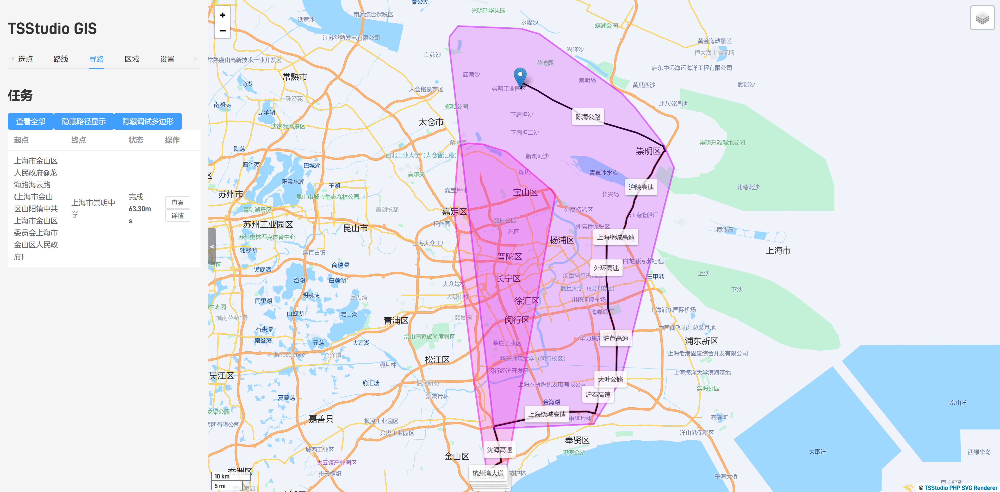

如图，在相同的迭代次数下，可以发现从金山开始的寻路先是走直线到了长江。发现过不去，然后开始逐渐扩展扇形，而崇明出发的寻路也是走直线到长江，但是由于其与长江更近，扩展更快，因此在相同的迭代次数下，崇明出发的寻路已经到达了金山，而金山出发的寻路还在扩展范围。

因此，我们可以认为，启发式寻路中，双向寻路的优化程度与估算函数、图的性质都有很大相关性。一个理想状态下，我们可以认为双向寻路的优化程度与非启发式搜索相同，的确只需要访问一半的点和边；在最差情况下，双向寻路至少可以提供一个“保底”：时间不会超过正反向搜索中**较快的一个的两倍**（如果对正反向各拿出一半的寻路次数）。

### 堆优化的研究

上文中说到，Dijkstra 算法的瓶颈在于维护最短路最短的节点。显然我们需要使用堆优化来完成这一工作。

**Oi Wiki** 给出了以下说明：

> 1. 从 $T$ 集合中，选取一个最短路长度最小的结点，移到 $S$ 集合中。
> 2. 对那些刚刚被加入 $S$ 集合的结点的所有出边执行松弛操作。

> - 暴力：不使用任何数据结构进行维护，每次 2 操作执行完毕后，直接在 $T$ 集合中暴力寻找最短路长度最小的结点。2 操作总时间复杂度为 $O(m)$ ，1 操作总时间复杂度为 $O(n^2)$ ，全过程的时间复杂度为 $O(n^2 + m) = O(n^2)$ 。
> - 二叉堆：每成功松弛一条边 $(u,v)$ ，就将 $v$ 插入二叉堆中（如果 $v$ 已经在二叉堆中，直接修改相应元素的权值即可），1 操作直接取堆顶结点即可。共计 $O(m)$ 次二叉堆上的插入（修改）操作， $O(n)$ 次删除堆顶操作，而插入（修改）和删除的时间复杂度均为 $O(\log n)$ ，时间复杂度为 $O((n+m) \log n) = O(m \log n)$ 。
> - 优先队列：和二叉堆类似，但使用优先队列时，如果同一个点的最短路被更新多次，因为先前更新时插入的元素不能被删除，也不能被修改，只能留在优先队列中，故优先队列内的元素个数是 $O(m)$ 的，时间复杂度为 $O(m \log m)$ 。
> - Fibonacci 堆：和前面二者类似，但 Fibonacci 堆插入的时间复杂度为 $O(1)$ ，故时间复杂度为 $O(n \log n + m)$ ，时间复杂度最优。但因为 Fibonacci 堆较二叉堆不易实现，效率优势也不够大，算法竞赛中较少使用。
> - 线段树：和二叉堆原理类似，不过将每次成功松弛后插入二叉堆的操作改为在线段树上执行单点修改，而 1 操作则是线段树上的全局查询最小值。时间复杂度为 $O(m \log n)$ 。

笔者对其中二叉堆和优先队列的描述存在否定态度，其不能说是错误，但存在一定的误导性。在实际测试中，**往往不 decrease key 的结果会比较好**。因此，在此展开分析其中的细节：

Oi Wiki 之所以会有这样的描述，显然是考虑到最差情况下，堆中会有 $O(m)$ 个元素。（即插入了 $O(m)$ 条边，里面有重复的点）。而如果能够 decrease key，堆中的元素数量就可以做到 $O(n)$ ，即对于已经在堆中的点，不再插入，而是直接 decrease key。这样的话，堆弹出队头的时间复杂度就可以做到 $O(n \log n)$ ，不过总共还是要执行 $O(m)$ 次**插入或 decrease key** 操作，所以时间复杂度的确是 $O(m\log n)$ 。

这看似在时间复杂度上存在优化，但如果基于最差情况（近完全图）， $m \sim n^2$ ，此时 $\log m \sim 2 \log n$ ，因此不 decrease key 的情况下，堆的时间复杂度仍然是 $O(n \log n)$ 。因此，对于二叉堆来说，是否 decrease key，时间复杂度是相同的。只是常数的差距。而对于最稀疏的完全图（近树） $m \sim n$ ，时间复杂度均是 $O(m \log n)$ 。

也就是说，图稠密与否只决定常数，并不对时间复杂度产生影响（主要原因是瓶颈在于遍历每条边后的插入和 decrease key 操作，这两个相比并没有更优，而弹出堆顶的复杂度也没有更优）。因此，不 decrease key 的二叉堆的时间复杂度是相同的。

我们再来考虑 decrease key 的代价，由于二叉堆 decrease key 的代价是 $O(\log n)$ ，对于稠密图，我们会执行 $O(m)$ 次 decrease key，因此，对于稠密图我们进行 $O(m\log n)$ 的操作。实际上为了做到 decrease key，我们还需要额外维护二叉堆中每个元素的 handle（用于在 decrease key 时快速定位元素），以及维护某一节点是否已经在二叉堆中（虽然使用哈希表可以做到 $O(1)$ 的查询与插入，但是这也是额外的常数）。

---

对于 Fibonacci 堆，情况会略有不同。decrease key 的代价是 $O(1)$ 。

即复杂度为 $O(a\log a+m)$ ，其中 $a$ 为堆中元素个数，对于不 decrease key 的情况， $a \sim m$ ；对于 decrease key 的情况， $a \sim n$ 。前半部分是弹出堆顶的代价，后半部分是插入、decrease key 的代价。

如果不 decrease key，Fibonacci 堆的时间复杂度是 $O(m \log m + m)=O(m \log m)=O(m \log n)$ ，而如果 decrease key，Fibonacci 堆的时间复杂度是 $O(n \log n + m)$ ，的确较优，其优势在于每个点只会在堆中出现一次。

对于稠密图，不 decrease key 的 Fibonacci 堆的时间复杂度是 $O(n^2 \log n)$ ；decrease key 的 Fibonacci 堆的时间复杂度是 $O(n \log n + n^2)=O(n^2)$ 。因此，对于稠密图，Fibonacci 堆的时间复杂度是 $O(n^2)$ 。在复杂度的层面来看，二者性能瓶颈的来源就变得不同了，对于不 decrease key 的 Fibonacci 堆，瓶颈在于弹出堆顶，而对于 decrease key 的 Fibonacci 堆，瓶颈在于 decrease key。

对于稀疏图，不 decrease key 的 Fibonacci 堆的时间复杂度是 $O(n \log n)$ ；decrease key 的 Fibonacci 堆的时间复杂度是 $O(n \log n + n)=O(n \log n)$ 。因此，对于稀疏图，二者的时间复杂度是相同的。由于 decrease key 带来额外的常数代价比堆中元素更少带来的收益更大，因此 decrease key 的 Fibonacci 堆在实际应用中并不会比不 decrease key 的 Fibonacci 堆更优。

---

对于实际的地图问题：

由于我们日常见到的地图往往是稀疏图（考虑大多数节点实际上只有 2-4 条边，故 $m \sim 4n$），因此在实际应用中，优先队列和二叉堆的时间复杂度是相同的，而 decrease key 的 Fibonacci 堆在实际应用中并不会比不 decrease key 的 Fibonacci 堆更优。

### Cache 的影响

由于时间比较紧促，且能力有限，此处无法给出一个特别定量的分析。但是，我可以根据实际现象给出一个主观臆断的分析：

**CPU 的 Cache 对于寻路速度的影响是巨大的。**

我们可以姑且不考虑边的信息（因为边很多，很难放进 Cache，且只会访问到一次，基本上是直接从内存访问的），那有什么东西是经常访问但是又不会很大的呢？用于排序的堆。堆的空间复杂度是 $O(n)$ ，又因为我们实际上只会访问大概几万个节点，如果一个节点的信息大约有 128B，那么堆的大小大约是 MB 级别。这个大小是可以放进 L2/L3 Cache 的。如果有更大的 Cache，就可以使整个堆一直在 Cache 中，这样就可以大大减少访问内存的次数。
